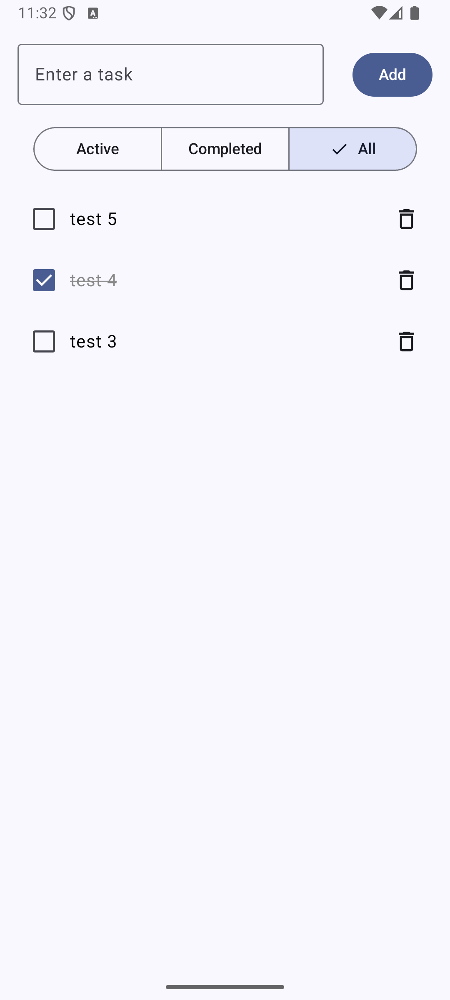

# ✅ To-Do List App - Jetpack Compose + Room + MVVM
A modern, fast, and intuitive task management app developed with **Jetpack Compose**, **Room**, and the **MVVM** architecture.

# ✨ Features
✅ Add new tasks to the list ➕

✅ Mark tasks as completed ✅

✅ Delete tasks 🗑️

✅ Filter tasks: **All / Active / Completed** 🔍

✅ Clear all completed tasks in one click 🧹

✅ Modern UI built with **Material 3** and **Jetpack Compose** 🎨

✅ Robust **MVVM** architecture 🔧

✅ Local data persistence with **Room Database** 💾

# 🛠️ Technologies Used
- **Kotlin** - Primary programming language
- **Jetpack Compose** - Declarative and modern UI toolkit
- **Room Database** - Local persistence layer
- **MVVM (Model-View-ViewModel)** - Clean and scalable architecture
- **StateFlow** - Reactive state management in ViewModel
- **Material Design 3** - Modern, accessible UI components
- **LazyColumn / Compose Components** - Efficient dynamic list rendering
# 🚀 Installation & Run
## Requirements:
✅ Android Studio Flamingo or newer

✅ JDK 17

✅ Kotlin 1.9.x (or a version compatible with Compose and Room)

## Steps:
```bash
Copy
git clone https://github.com/your-github/todo-compose-app.git
cd todo-compose-app
./gradlew assembleDebug
```
Open the project in Android Studio, and run the app on an emulator or physical device.

# 🎯 Key Learnings & Objectives
📝 **Deepened Jetpack Compose knowledge**: Building dynamic interfaces with `LazyColumn`, `StateFlow`, and handling user interactions.

📚 **Applied MVVM architecture**: Clear separation of concerns between UI, business logic, and data access layers.

💾 **Mastered Room Database**: Creating local SQLite persistence, working with DAOs, and writing efficient queries.

📲 **State Management with StateFlow**: Reactive UI data flow managed inside the ViewModel.

♿ **Accessibility (a11y)**: Leveraging Material 3 components to enhance the user experience and accessibility.

🧹 **Clean Code & Modularity**: Well-structured, maintainable codebase with clearly separated components.

# 🚀 Why This Project?
This project was designed to strengthen my skills in Jetpack Compose and modern Android development, while practicing core concepts such as MVVM architecture, local persistence, and reactive state management. It also provides a solid base for more complex apps (project management, collaborative tools, etc.).


# 📸 Preview

